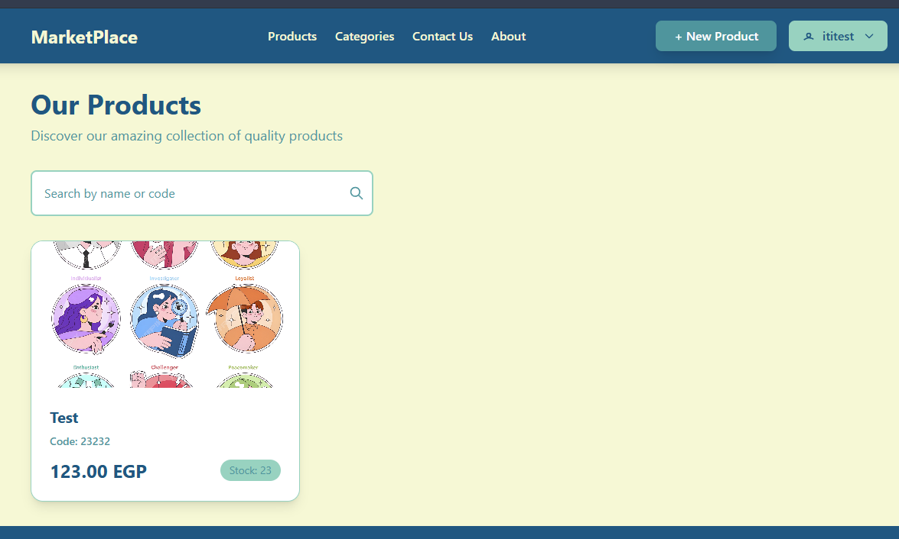
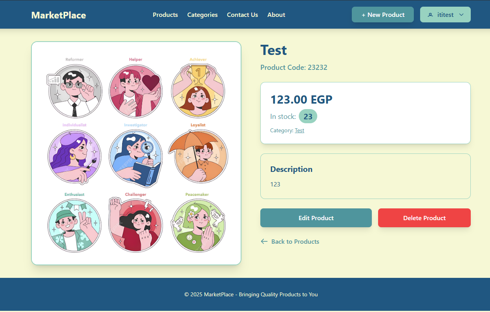
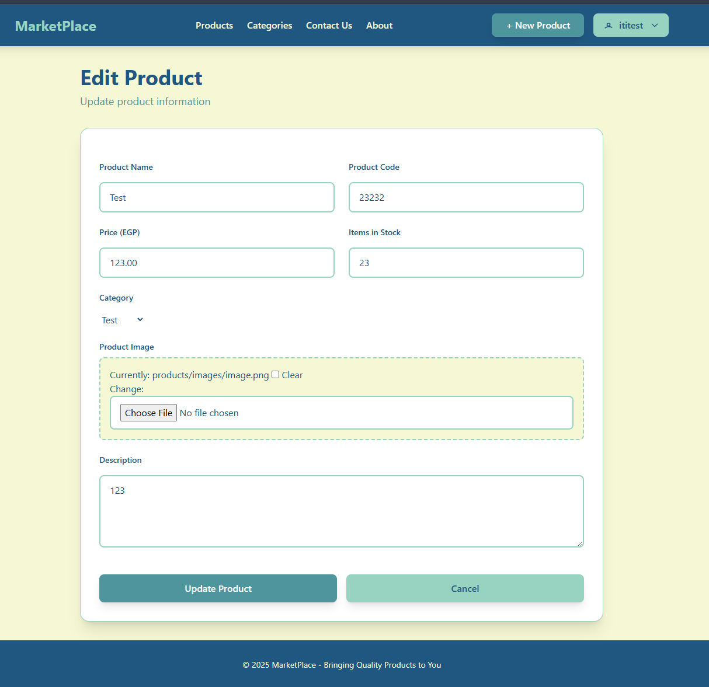
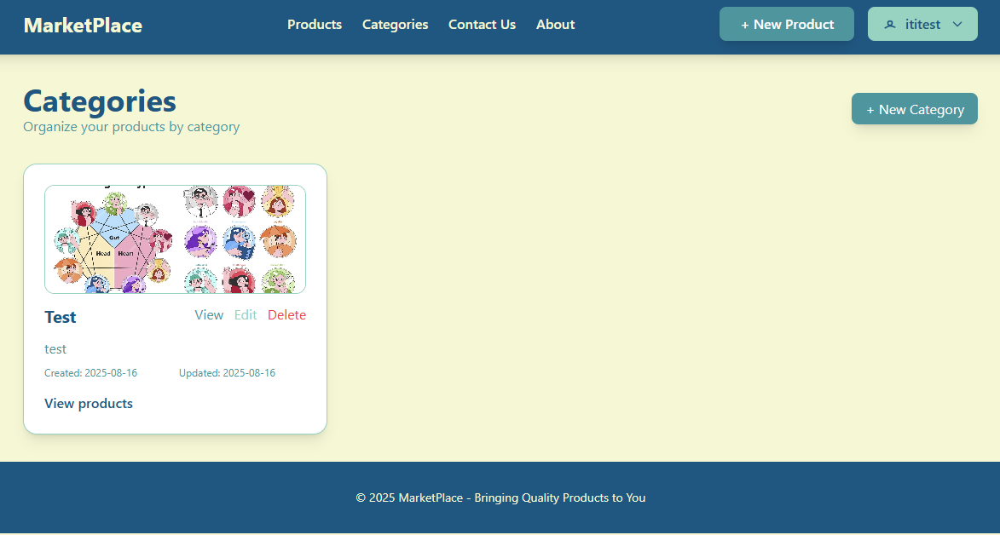
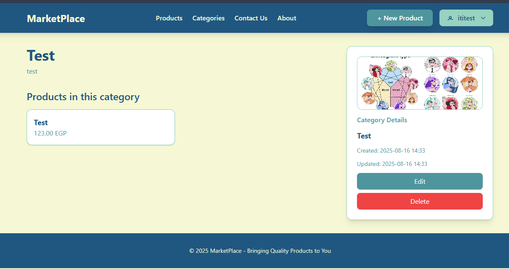
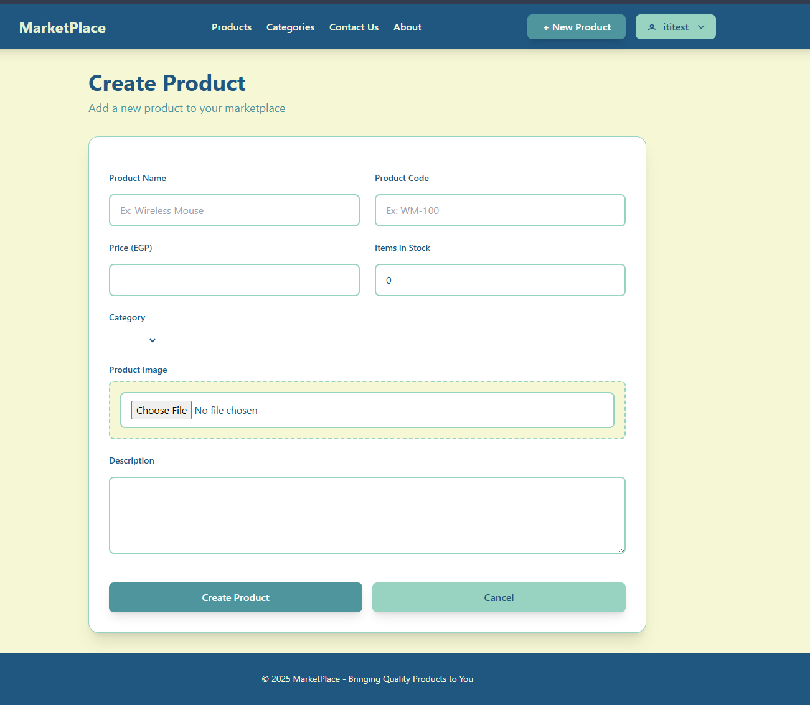
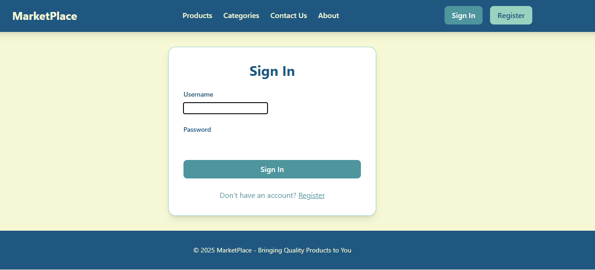
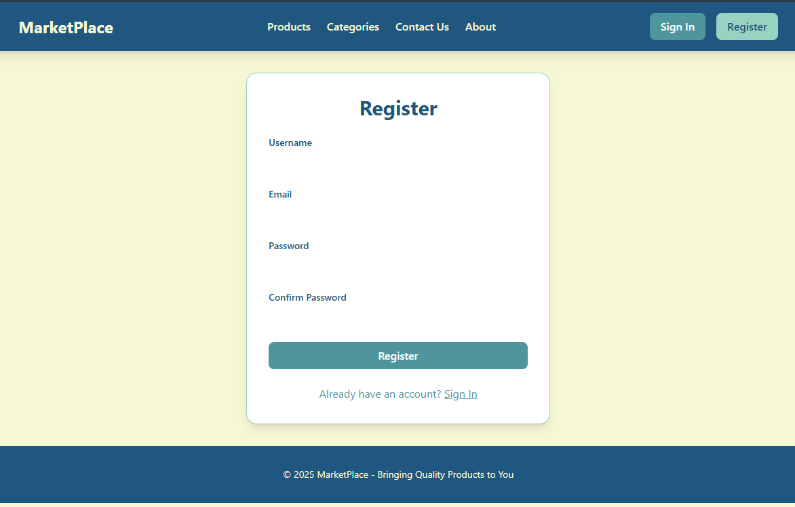

# ITILab Django Project

## Overview

This is a Django-based web application project structured with multiple apps:

- `aboutus`: Handles the About Us page.
- `categories`: Manages product categories.
- `contactus`: Handles the Contact Us page.
- `products`: Manages product listings and related features.

## Features

- User Login (Registration is not working properly)
- Product and category management
- About Us and Contact Us pages

## License

This project is for educational purposes.

## Pictures

