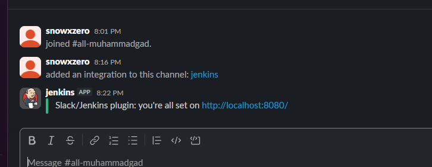

# Lab2


## Jenkins Agent

Docker file

```Docker
FROM jenkins/agent:latest-jdk17

USER root

RUN apt-get update && \
    apt-get install -y docker.io openssh-server openjdk-17-jdk && \
    mkdir /var/run/sshd && \
    rm -rf /var/lib/apt/lists/*

# Set passwords
RUN echo "jenkins:jenkins" | chpasswd && \
    echo "root:root" | chpasswd

# Ensure jenkins user is in the docker group (create it if missing)
RUN groupadd -f docker && usermod -aG docker jenkins

EXPOSE 22

# Fix socket ownership at startup, then run sshd (a Problem i had :D)
ENTRYPOINT ["/bin/sh", "-c", "chown root:docker /var/run/docker.sock || true && exec /usr/sbin/sshd -D"]

```

```bash

docker build -t jenkins-agent-docker-with-ssh .

docker run -d \
  --name jenkins-agent-docker-ssh \
  -p 2222:22 \
  -v //var/run/docker.sock:/var/run/docker.sock \
  --user root \
  jenkins-agent-docker-with-ssh

# test if working
ssh jenkins@localhost -p 2222
```

and the agent works with docker :D


now we need to connect it to the master jenkins we created yesterday

I had alot of errors and made alot of adjustments
but at last its working and connected


## Instance Agent

### Terraform part


### Ansible Part

I am on windows so i use ansible via a docker container

```bash
docker run --rm -it \
  -v /$(pwd):/ansible \
  -v //c/Users/SNOW/.ssh:/root/.ssh \
  -w //ansible \
  williamyeh/ansible:alpine3 \
  sh -c "chmod 600 /root/.ssh/* && ansible-playbook -i inventory.ini configure-jenkins-agent.yaml"

```


### Adding as a node


## Jenkins File

### Testing with simple jenkins file

IT WORKS


### Acctual app

Im using a calc webapp project
This is the repo im using with the docker file of the app image and the jenkins file

<https://github.com/SNOWxZERO/Calculator>

Finally it works :D


#### the docker agent


#### the aws instance

I had to add an ingress rule to access port 30000

and now I can Access it :D


## MultiBranch Pipeline

edited the jenkins file to echo the branch name, added jenkinstest branch, and then created the pipeline

### First branch (jenkinstest)


### First branch (master)


## Slack Notification

I followed a tutorial this is the outcome


## Webhook

I followed a tutorial also :D
I installed ngrok and run it then added the link in github to create a webhook


after alot of testing we got this


gg
