# Kubernetes Lab Tasks

## 1. Install k8s cluster (minikube)

**Status:** Done

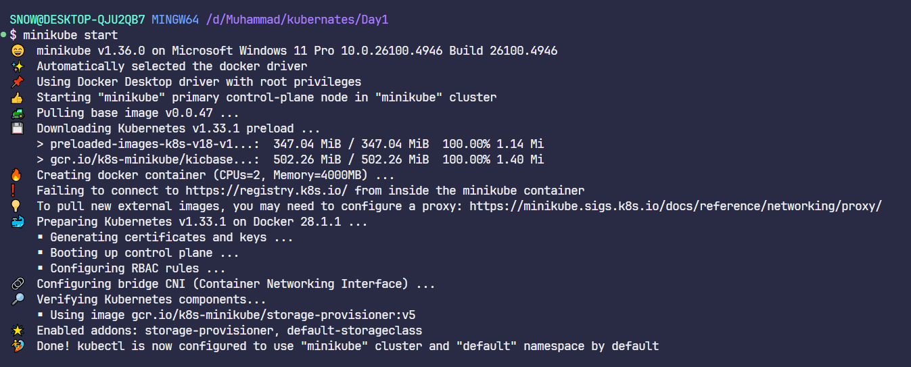

## 2. Create a pod with the name `redis` and with the image `redis`

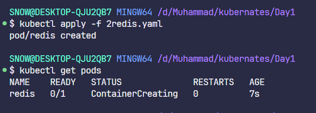

## 3. Create a pod with the name `nginx` and with the image `nginx123`

*Use a pod-definition YAML file.*

## 4. What is the nginx pod status?

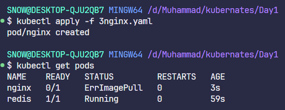

## 5. Change the nginx pod image to `nginx` and check the status again

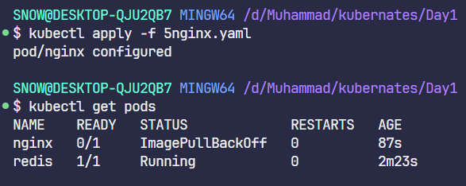

## 6. How many ReplicaSets exist on the system?

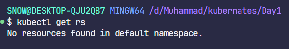

## 7. Create a ReplicaSet

- **Name:** replica-set-1
- **Image:** busybox
- **Replicas:** 3

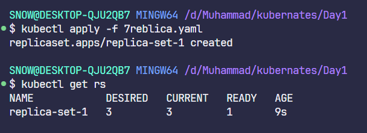

## 8. Scale the ReplicaSet `replica-set-1` to 5 PODs

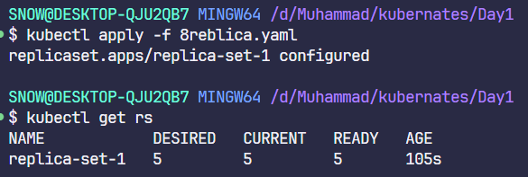

## 9. How many PODs are READY in the `replica-set-1`?

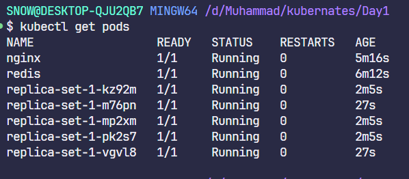

## 10. Delete any one of the 5 PODs then check how many PODs exist now

**Q:** Why are there still 5 PODs, even after you deleted one?

**A:** Because ReplicaSet ensures that there are always 5 pods. If one is deleted, it creates another one.

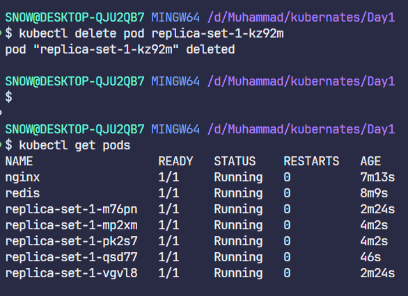

## 11. How many Deployments and ReplicaSets exist on the system?

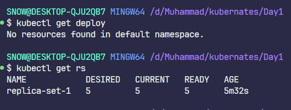

## 12. Create a Deployment

- **Name:** deployment-1
- **Image:** busybox
- **Replicas:** 3

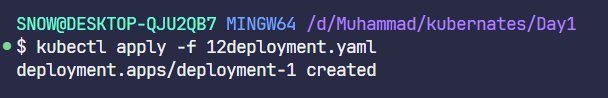

## 13. How many Deployments and ReplicaSets exist on the system now?

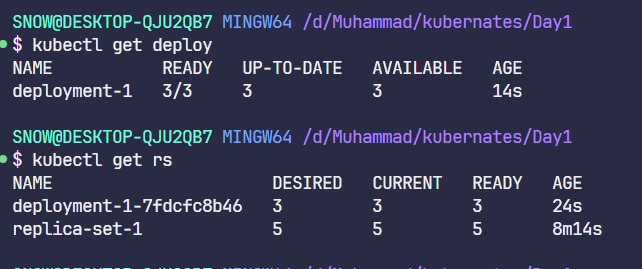

## 14. How many pods are ready with the `deployment-1`?

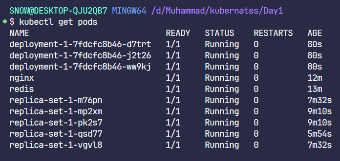

## 15. Update `deployment-1` image to `nginx` then check the ready pods again

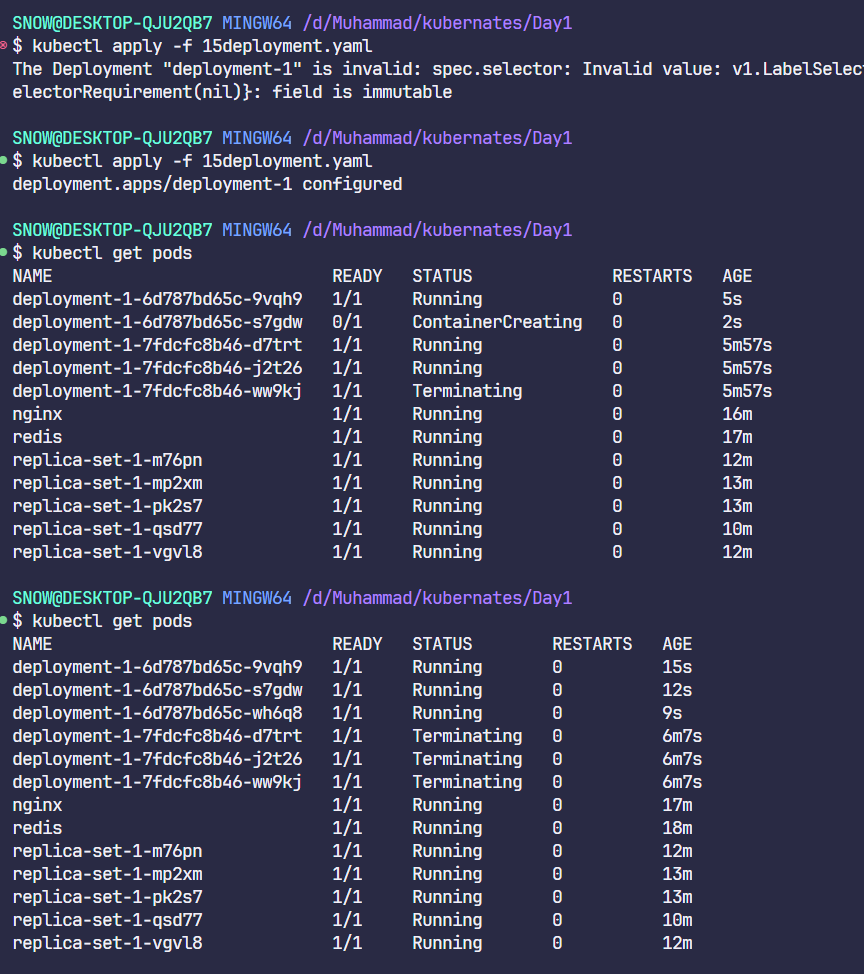
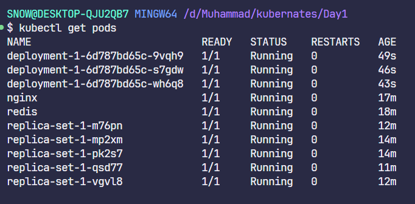

## 16. Run `kubectl describe deployment deployment-1` and check events

**Q:** What is the deployment strategy used to upgrade the deployment-1?

**A:** RollingUpdate

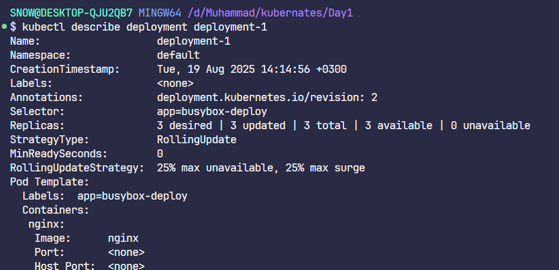

## 17. Rollback the `deployment-1`

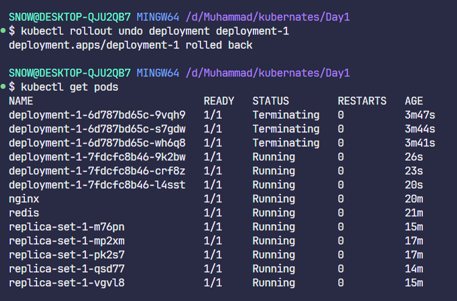

**Q:** What is the used image with the deployment-1?

**A:** busybox

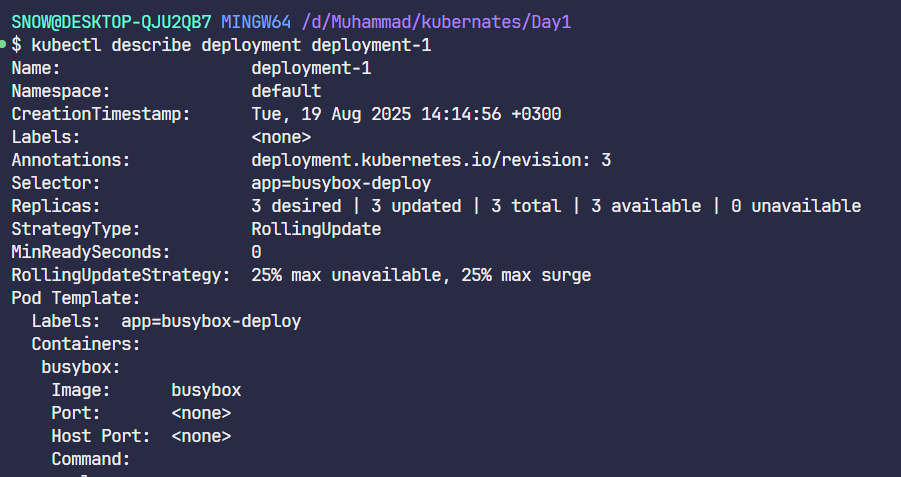

## 18. Create a deployment using nginx image with latest tag only

- **Image:** nginx:latest
- **Name:** nginx-deployment
- **App labels:**
	- app: nginx-app
	- type: front-end
- **Container name:** nginx-container
- **Replicas:** 3

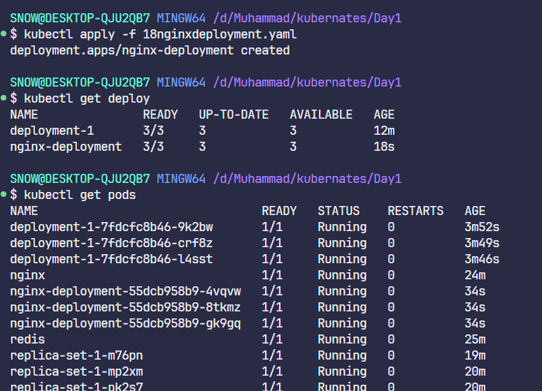
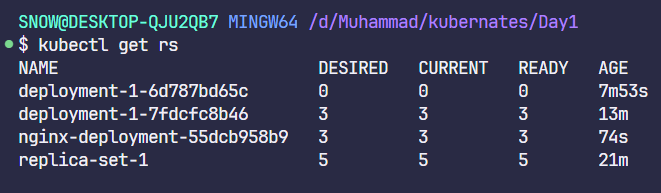
