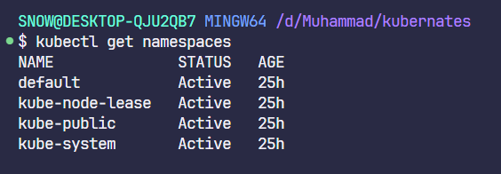
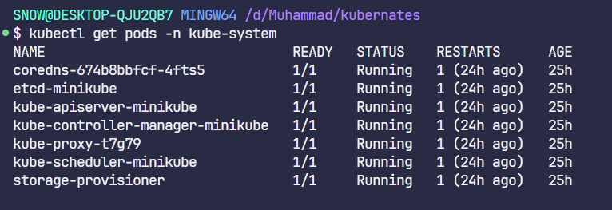
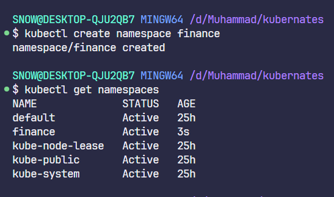
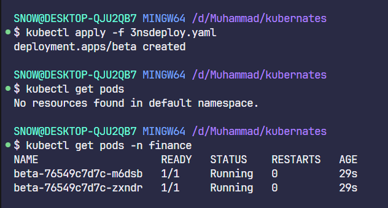
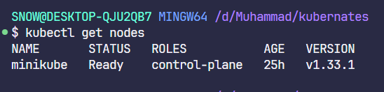
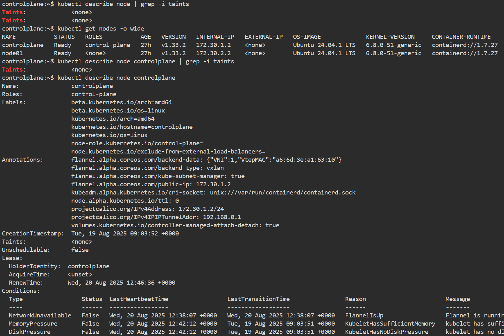
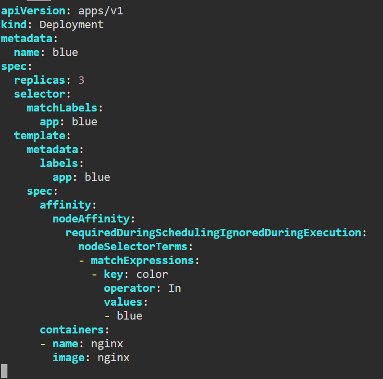
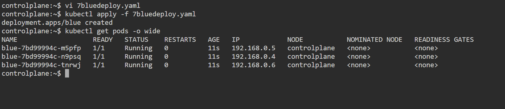

# Kubernetes Day 2 Tasks

---

## 1. How many Namespaces exist on the system?

**Answer:** 4

---

## 2. How many pods exist in the kube-system namespace?

**Answer:** 7

---

## 3. Create a deployment with

- **Name:** `beta`
- **Image:** `redis`
- **Replicas:** 2
- **Namespace:** `finance`
- **Resources Requests:**
  - CPU: 0.5 vCPU
  - Memory: 1G
- **Resources Limits:**
  - CPU: 1 vCPU
  - Memory: 2G

---

## 4. How many Nodes exist on the system?

---

> **Note:** For questions 5 to 7, use the following cluster:
> [KillerCoda Kubernetes Playground](https://killercoda.com/playgrounds/scenario/kubernetes)

---

## 5. Do you see any taints on master?

---

## 6. Apply a label `color=blue` to the master node

---

## 7. Create a new deployment named `blue` with the nginx image and 3 replicas

- Set Node Affinity to the deployment to place the pods on master only
- **NodeAffinity:** `requiredDuringSchedulingIgnoredDuringExecution`
- **Key:** `color`
- **Values:** `blue`

