# Kubernetes Day 3 Tasks

---

## 1. How many DaemonSets are created in the cluster in all namespaces?

**Answer:** 1

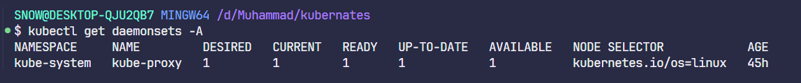

---

## 2. What DaemonSets exist on the kube-system namespace?

**Answer:** 1

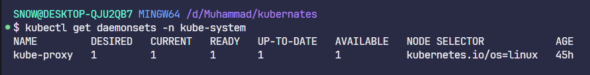

---

## 3. What is the image used by the POD deployed by the kube-proxy DaemonSet?

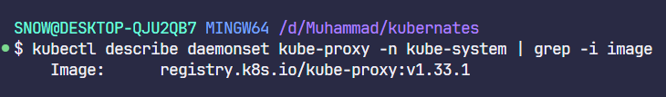

---

## 4. Deploy a DaemonSet for FluentD Logging

**Specifications:**

- **Name:** `elasticsearch`
- **Namespace:** `kube-system`
- **Image:** `k8s.gcr.io/fluentd-elasticsearch:1.20`

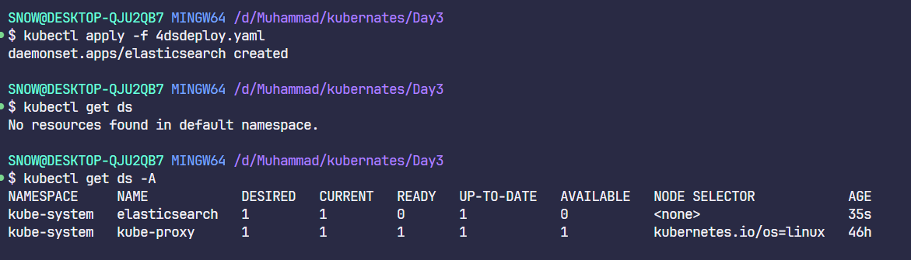

**After changing image to `fluentd:v1.16.9-debian-1.0`:**

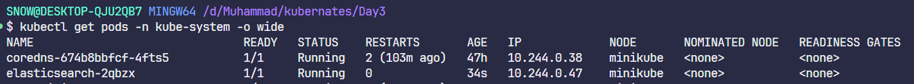

---

## 5. Deploy a pod named nginx-pod using the nginx:alpine image

**Specifications:**

- **Name:** `nginx-pod`
- **Image:** `nginx:alpine`
- **Labels:** `tier=backend`

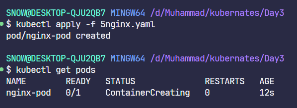
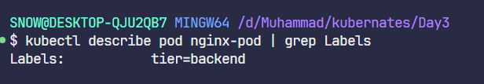

---

## 6. Deploy a test pod using the nginx:alpine image

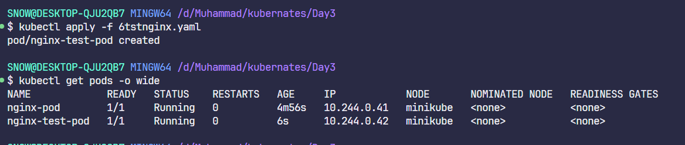

---

## 7. Create a service backend-service to expose the backend application within the cluster on port 80

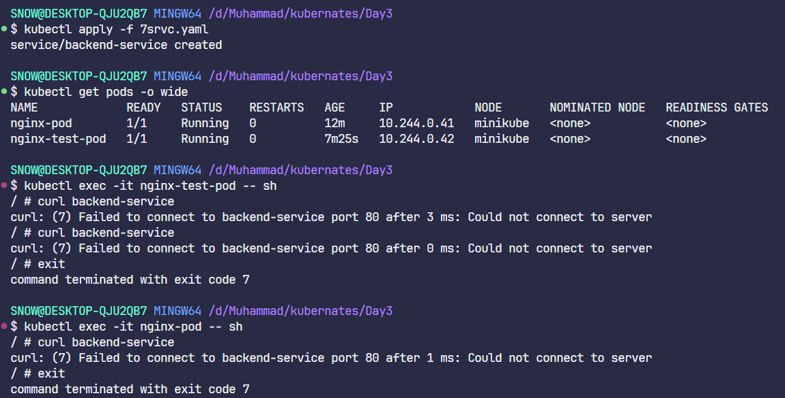
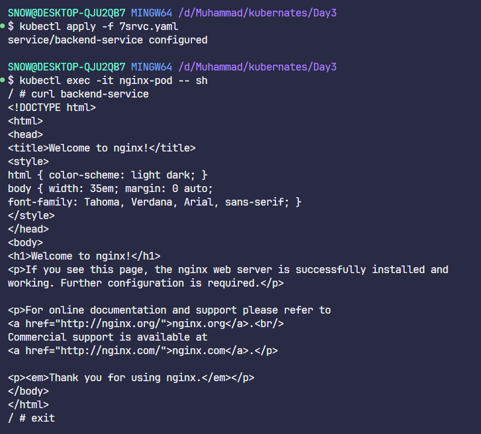

---

## 8. Try to curl the backend-service from the test pod. What is the response?

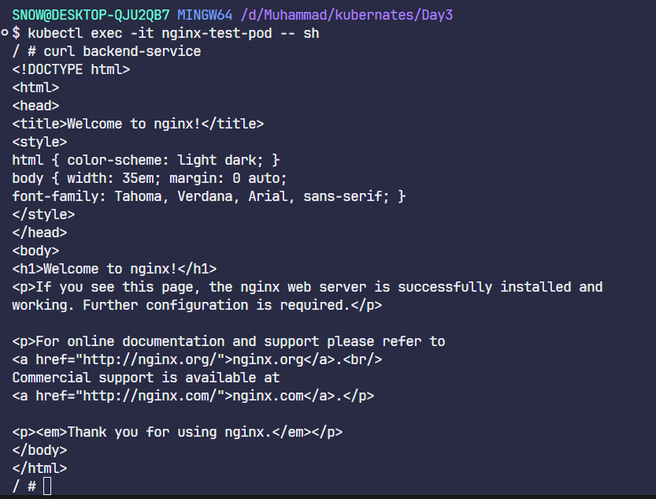

---

## 9. Create a deployment named web-app using the image nginx with 2 replicas

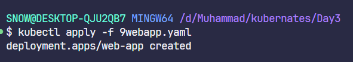

---

## 10. Expose the web-app as service web-app-service application on port 80 and nodeport 30082

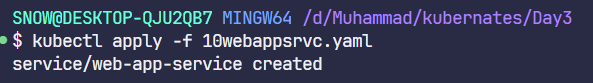

---

## 11. Access the web app from the node

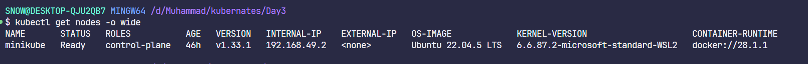
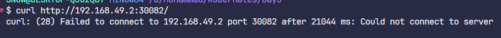
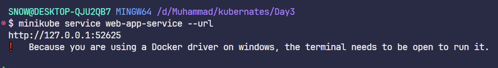
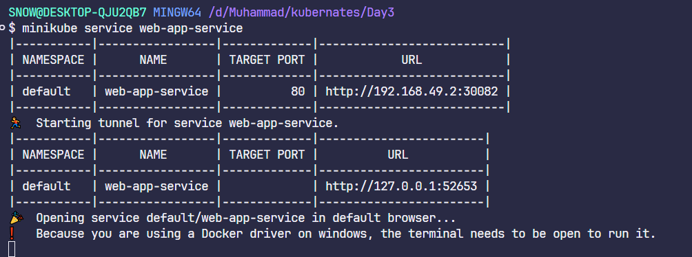
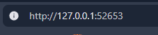
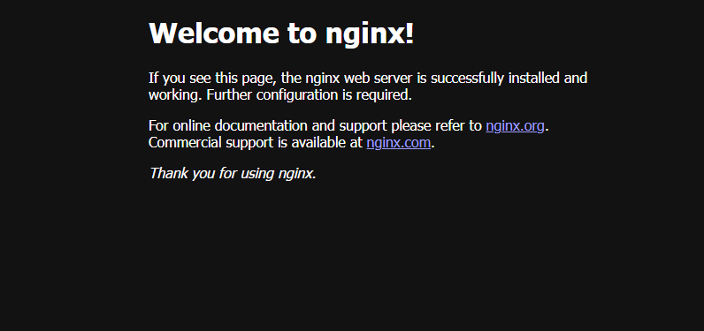

---

## 12. How many static pods exist in this cluster in all namespaces?

**Answer:** 4
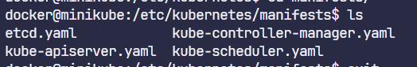

---

## 13. On which nodes are the static pods created currently?

**Answer:** On the minikube node (I only have it)

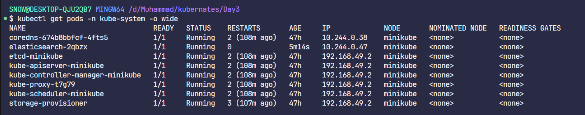

---
