# Kubernetes Day 4 Tasks

## 1. How many ConfigMaps exist in the environment?

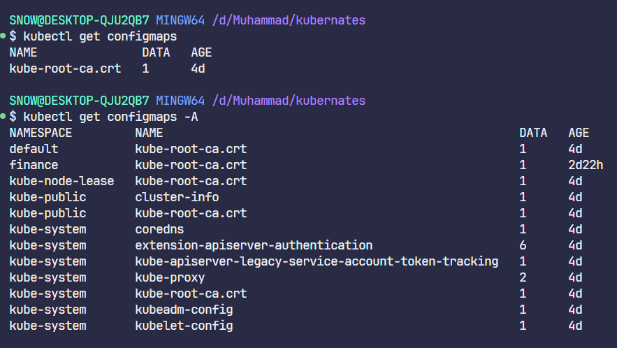

---

## 2. Create a new ConfigMap

**ConfigMap Name:** `webapp-config-map`  
**Data:**  

- `APP_COLOR=darkblue`

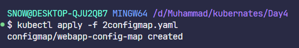
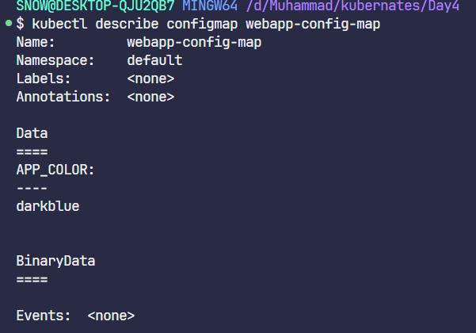

---

## 3. Create a `webapp-color` POD with nginx image and use the created ConfigMap

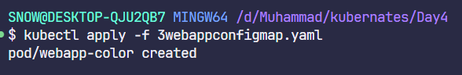

---

## 4. How many Secrets exist on the system?

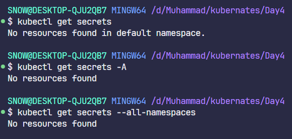

---

## 5. How many secrets are defined in the `default-token` secret?

There are no secrets in `default-token` here in killercoda.

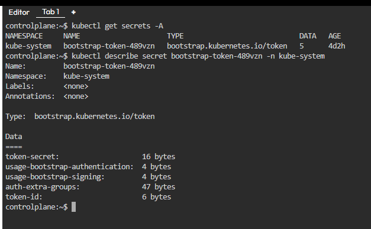

---

## 6. Create a POD called `db-pod` with the image `mysql:5.7` and check the POD status

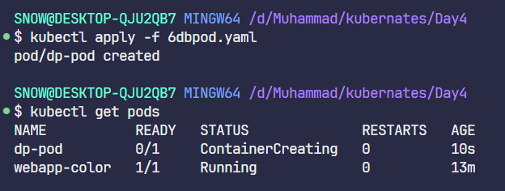
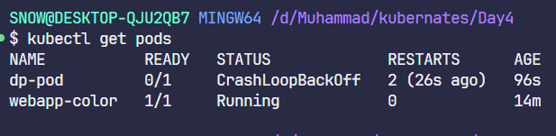

---

## 7. Why is the `db-pod` status not ready?

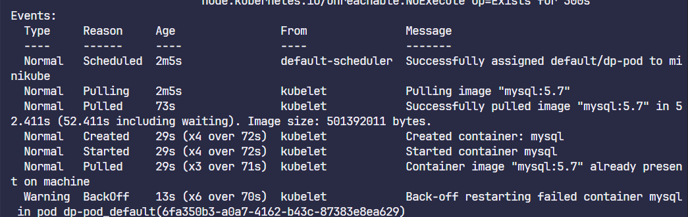

---

## 8. Create a new secret named `db-secret` with the following data

- `MYSQL_DATABASE=sql01`
- `MYSQL_USER=user1`
- `MYSQL_PASSWORD=password`
- `MYSQL_ROOT_PASSWORD=password123`

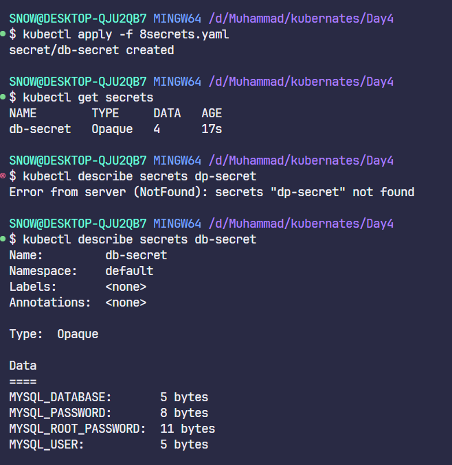

---

## 9. Configure `db-pod` to load environment variables from the newly created secret

_Delete and recreate the pod if required._

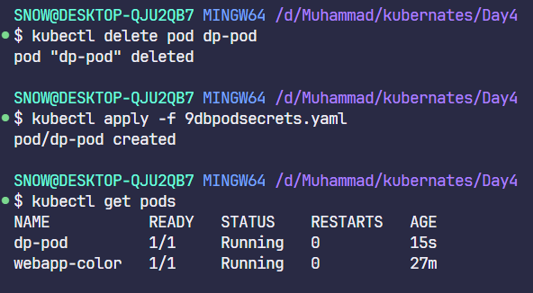

---

## 10. Create a multi-container pod with 2 containers

- **Pod Name:** `yellow`
- **Container 1:**  
  - Name: `lemon`  
  - Image: `busybox`
- **Container 2:**  
  - Name: `gold`  
  - Image: `redis`

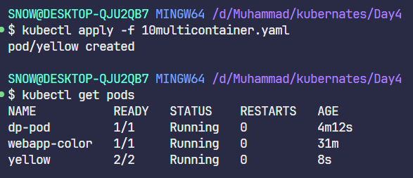

---

## 11. Create a pod `red` with redis image and use an initContainer

- **InitContainer:**  
  - Image: `busybox`
  - Command: `sleep 20`

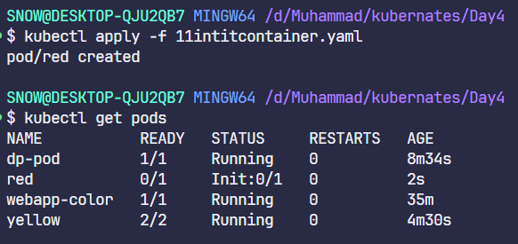
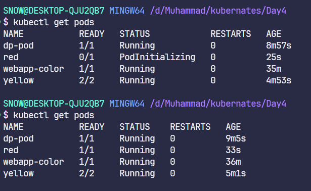

---

## 12. Create a pod named `print-envars-greeting`

- **Container Name:** `print-env-container`
- **Image:** `bash`
- **Environment Variables:**
  - `GREETING=Welcome to`
  - `COMPANY=DevOps`
  - `GROUP=Industries`
- **Command:**  
  `echo ["$(GREETING) $(COMPANY) $(GROUP)"]`

_Check the output using:_  
`kubectl logs -f [pod-name]`

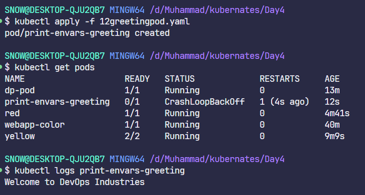

---

## 13. Where is the default kubeconfig file located in the current environment?

`C:\Users\SNOW\.kube\config`

---

## 14. How many clusters are defined in the default kubeconfig file?

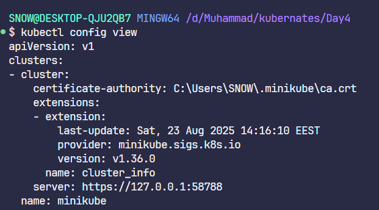

---

## 15. What is the user configured in the current context?

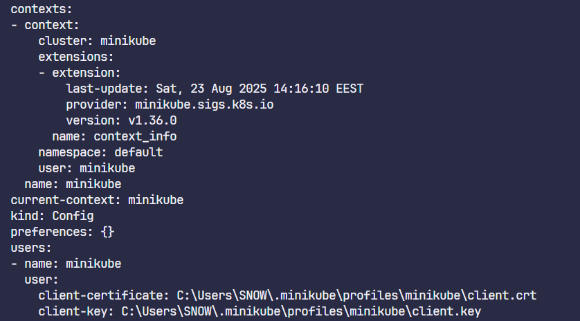

---

## 16. Create a Persistent Volume with the given specification

- **Volume Name:** `pv-log`
- **Storage:** 100Mi
- **Access Modes:** ReadWriteMany
- **Host Path:** `/pv/log`

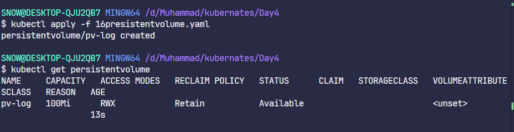

---

## 17. Create a Persistent Volume Claim with the given specification

- **Volume Name:** `claim-log-1`
- **Storage Request:** 50Mi
- **Access Modes:** ReadWriteMany

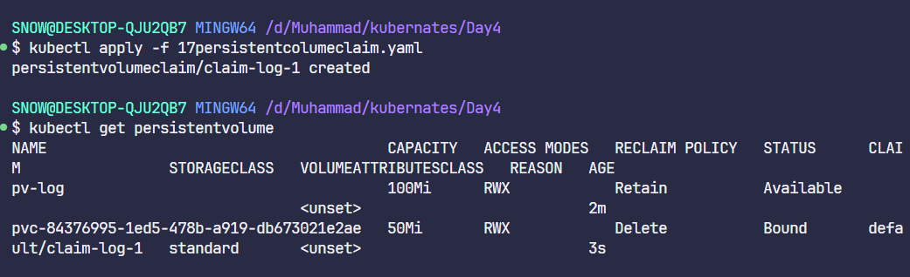

---

## 18. Create a webapp pod to use the persistent volume claim as its storage

- **Name:** `webapp`
- **Image Name:** `nginx`
- **Volume:** PersistentVolumeClaim=`claim-log-1`
- **Volume Mount:** `/var/log/nginx`

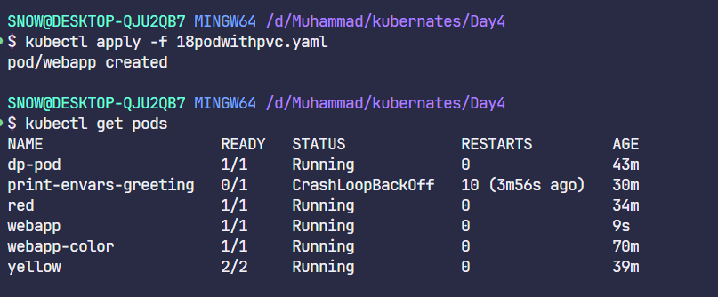
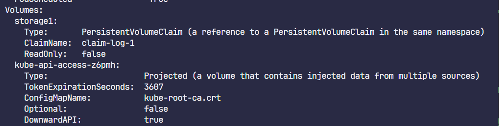
