# Kubernetes Day 5 Tasks - HAProxy Ingress Controller Setup

## 1. Create a namespace `haproxy-controller-devops`

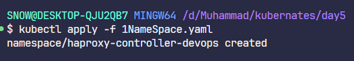

---

## 2. Create a ServiceAccount `haproxy-service-account-devops` under the same namespace

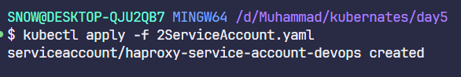

---

## 3. Create a ClusterRole named `haproxy-cluster-role-devops`

**Permissions:**
- Resources: `configmaps`, `secrets`, `endpoints`, `nodes`, `pods`, `services`, `namespaces`, `events`, `serviceaccounts`
- Verbs: `get`, `list`, `watch`, `create`, `patch`, `update`

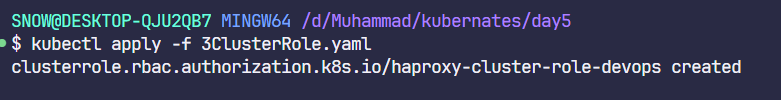

---

## 4. Create a ClusterRoleBinding named `haproxy-cluster-role-binding-devops`

**Configuration:**
- **Namespace:** `haproxy-controller-devops`
- **RoleRef:**
  - `apiGroup`: `rbac.authorization.k8s.io`
  - `kind`: `ClusterRole`
  - `name`: `haproxy-cluster-role-devops`
- **Subjects:**
  - `kind`: `ServiceAccount`
  - `name`: `haproxy-service-account-devops`
  - `namespace`: `haproxy-controller-devops`

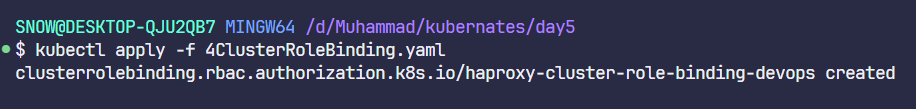

---

## 5. Create a backend deployment named `backend-deployment-devops`

**Configuration:**
- **Namespace:** `haproxy-controller-devops`
- **Labels:** `run=ingress-default-backend`
- **Replicas:** 1
- **Selector:** `matchLabels.run=ingress-default-backend`
- **Template Labels:** `run=ingress-default-backend`
- **Container:**
  - Name: `backend-container-devops`
  - Image: `gcr.io/google_containers/defaultbackend:1.0`
  - Port: `8080`

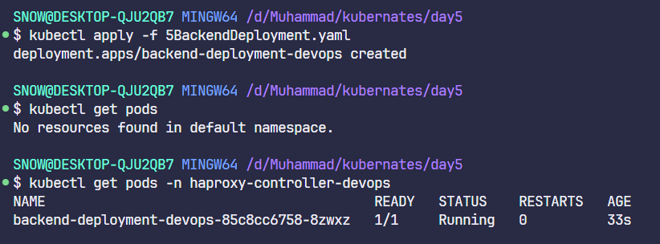

---

## 6. Create a service for backend named `service-backend-devops`

**Configuration:**
- **Namespace:** `haproxy-controller-devops`
- **Labels:** `run=ingress-default-backend`
- **Selector:** `run=ingress-default-backend`
- **Port:**
  - Name: `port-backend`
  - Protocol: `TCP`
  - Port: `8080`
  - TargetPort: `8080`

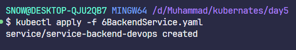

---

## 7. Create a frontend deployment named `haproxy-ingress-devops`

**Configuration:**
- **Namespace:** `haproxy-controller-devops`
- **Replicas:** 1
- **Selector:** `matchLabels.haproxy-ingress`
- **Template Labels:** `run=haproxy-ingress`
- **ServiceAccount:** `haproxy-service-account-devops`

**Container Specifications:**
- **Name:** `ingress-container-devops`
- **Image:** `haproxytech/kubernetes-ingress:1.7.10`
- **Args:** `--default-backend-service=haproxy-controller-devops/service-backend-devops`
- **Resources:**
  - CPU: `500m`
  - Memory: `50Mi`
- **LivenessProbe:**
  - Path: `/healthz`
  - Port: `1024`

**Ports:**
- `http`: `80`
- `https`: `443`
- `stat`: `1024`

**Environment Variables:**
- `TZ`: `Etc/UTC`
- `POD_NAME`: `metadata.name`
- `POD_NAMESPACE`: `metadata.namespace`

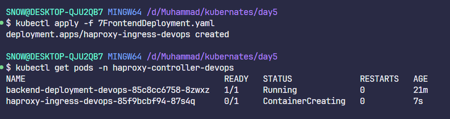
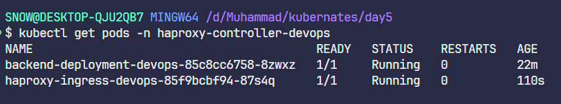

---

## 8. Create a service for frontend named `ingress-service-devops`

**Configuration:**
- **Namespace:** `haproxy-controller-devops`
- **Labels:** `run=haproxy-ingress`
- **Selector:** `run=haproxy-ingress`
- **Type:** `NodePort`

**Ports:**
- **HTTP:**
  - Port: `80`
  - TargetPort: `80`
  - NodePort: `32456`
- **HTTPS:**
  - Port: `443`
  - TargetPort: `443`
  - NodePort: `32567`
- **Stat:**
  - Port: `1024`
  - TargetPort: `1024`
  - NodePort: `32678`

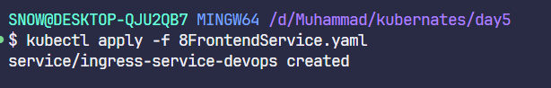

---

## Final Output

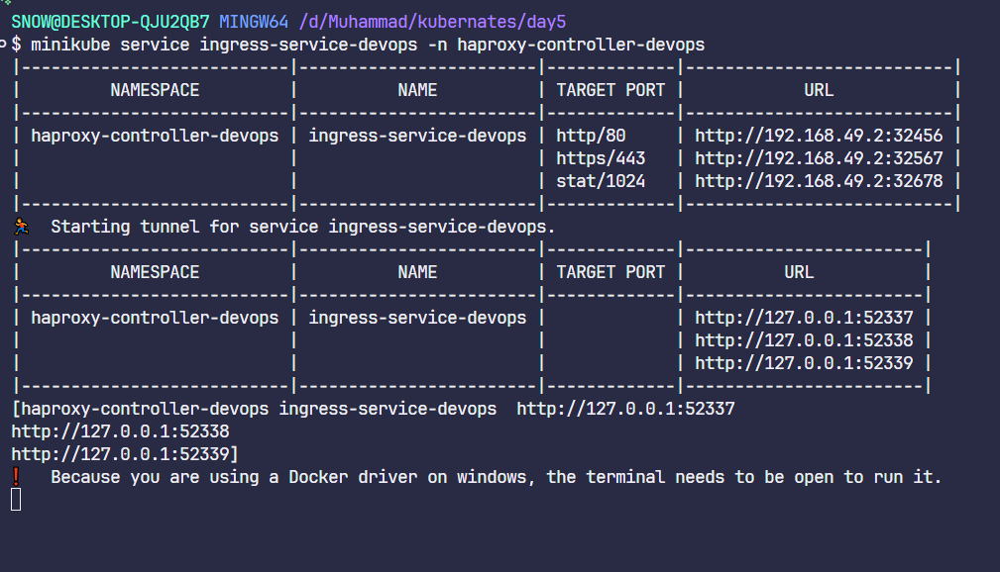

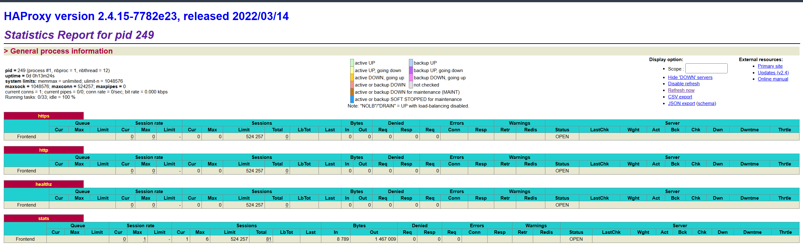