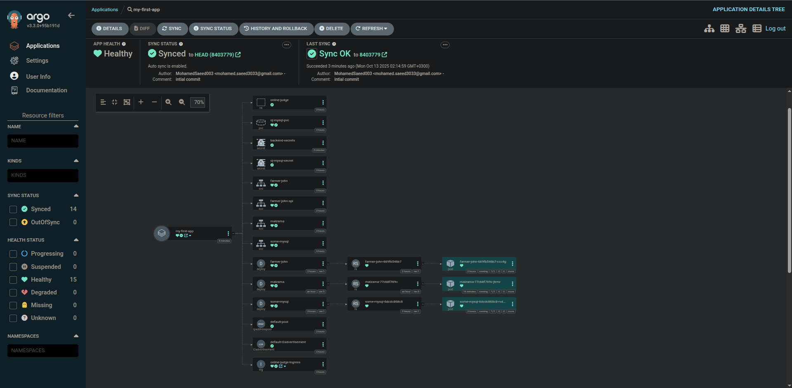
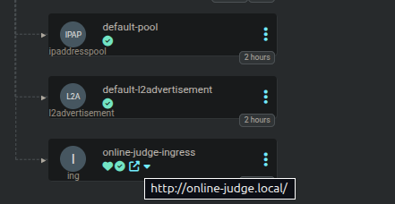
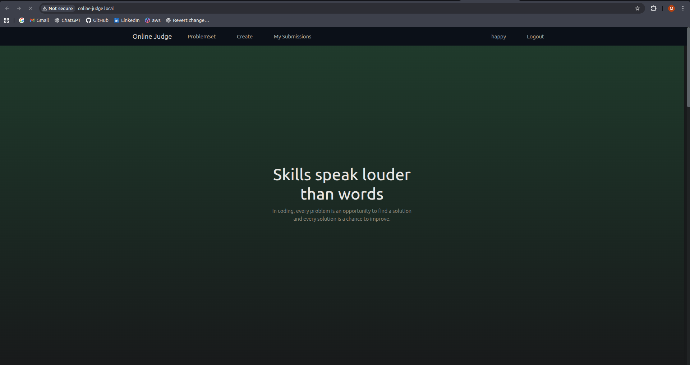

# 🏛️ Online Judge ArgoCD

```bash
 ██████╗ ███╗   ██╗██╗     ██╗███╗   ██╗███████╗      ██╗██╗   ██╗██████╗  ██████╗ ███████╗
██╔═══██╗████╗  ██║██║     ██║████╗  ██║██╔════╝      ██║██║   ██║██╔══██╗██╔════╝ ██╔════╝
██║   ██║██╔██╗ ██║██║     ██║██╔██╗ ██║█████╗        ██║██║   ██║██║  ██║██║  ███╗█████╗  
██║   ██║██║╚██╗██║██║     ██║██║╚██╗██║██╔══╝   ██   ██║██║   ██║██║  ██║██║   ██║██╔══╝  
╚██████╔╝██║ ╚████║███████╗██║██║ ╚████║███████╗ ╚█████╔╝╚██████╔╝██████╔╝╚██████╔╝███████╗
 ╚═════╝ ╚═╝  ╚═══╝╚══════╝╚═╝╚═╝  ╚═══╝╚══════╝  ╚════╝  ╚═════╝ ╚═════╝  ╚═════╝ ╚══════╝
```

## 📋 Overview

This guide explains how to deploy the Online Judge application (MySQL, Farmer-John API, Tony API, Malzama frontend) to a Kubernetes cluster and manage it with Argo CD using a GitHub repository.

### 🎯 What is Online Judge?

Online Judge is a full-stack problem-solving platform composed of:

- **Malzama (Frontend)**: React + TypeScript app for users to browse problems, submit code, and view results
- **Farmer‑John (Main Backend)**: ASP.NET Core API with users, auth, problems, tags, and submission coordination
- **Tony (Execution Backend)**: ASP.NET Core + worker that runs code submissions in isolated Docker containers and returns runtime/memory/output

### 🏗️ Architecture Flow

```
┌─────────────────┐
│  User (Browser) │
└─────────┬───────┘
          │
          ▼
┌─────────────────┐
│ Malzama (React) │
└─────────┬───────┘
          │
          ▼
┌─────────────────────────────────┐
│ Farmer‑John API                │
│ (auth, problems, submissions)   │
└─────────┬───────────────────────┘
          │
          ▼
┌─────────────────────────────────┐
│ Tony Service/Worker             │
│ (code execution)                │
└─────────┬───────────────────────┘
          │
          ▼
┌─────────────────────────────────┐
│ Docker Sandbox Container        │
│ (per submission)                │
│ Returns: verdict, runtime,      │
│         memory, output          │
└─────────────────────────────────┘
```

## 🐳 Preparing the Images

We had a problem with the app itself in understanding it and its routes to make it even work locally before turning it into a containerized version to run it on Kubernetes.

---

### 🚜 FarmerJohn Image (Backend)

After a lot of troubleshooting we managed to create an image of the backend with relatively small size to use the .NET app (including migration to the database and adding a default tag to add problem sets) so the backend should be run after making sure that the database is initialized.

Here is the Dockerfile used for the image:

```Dockerfile
# Build stage
FROM mcr.microsoft.com/dotnet/sdk:8.0 AS build
WORKDIR /src

# Copy csproj files
COPY FarmerJohnServiceLayer/FarmerJohnServiceLayer.csproj FarmerJohnServiceLayer/
COPY FarmerJohnBusinessLayer/FarmerJohnBusinessLayer.csproj FarmerJohnBusinessLayer/
COPY FarmerJohnDataAccessLayer/FarmerJohnDataAccessLayer.csproj FarmerJohnDataAccessLayer/
COPY FarmerJohnCommon/FarmerJohnCommon.csproj FarmerJohnCommon/

# Restore dependencies
RUN dotnet restore FarmerJohnServiceLayer/FarmerJohnServiceLayer.csproj

# Copy everything else
COPY . .

# Build and publish
WORKDIR /src/FarmerJohnServiceLayer
RUN dotnet publish -c Release -o /app/publish

# Runtime stage
FROM mcr.microsoft.com/dotnet/aspnet:8.0 AS runtime
WORKDIR /app

# Create non-root user
RUN addgroup --system appgroup && adduser --system --ingroup appgroup --no-create-home appuser

# Copy published app
COPY --from=build /app/publish .

# Environment variables
ENV ASPNETCORE_ENVIRONMENT=Production
ENV ASPNETCORE_URLS=http://+:80

# Expose ports
EXPOSE 80

# Switch to non-root user
USER appuser

# Start the application
ENTRYPOINT ["dotnet", "FarmerJohnServiceLayer.dll"]
```

---

### 🌐 Malzama Image (Frontend)

For the frontend image we used nginx to manage routes inside the app as follows:

```nginx
# Set the user for worker processes. This should match the NGINX_USER defined in the Dockerfile (appuser).
user appuser appgroup;

pid /tmp/nginx/run/nginx.pid;

worker_processes auto;

events {
    worker_connections 1024;
}

http {
    include       mime.types;
    default_type  application/octet-stream;

    sendfile        on;
    keepalive_timeout 65;

    server {
        listen 8080;
        server_name  localhost;

        # Root directory for frontend files
        root /usr/share/nginx/html;
        index index.html;

        # Serve frontend SPA
        location / {
            try_files $uri $uri/ /index.html;
        }

        # Proxy API requests to backend
        location /api/ {
            proxy_pass http://farmer-john-api:80;  # backend container name + HTTP port, strip /api prefix
            proxy_set_header Host $host;
            proxy_set_header X-Real-IP $remote_addr;
            proxy_set_header X-Forwarded-For $proxy_add_x_forwarded_for;
            proxy_set_header X-Forwarded-Proto $scheme;
        }

        # Prevent Nginx version exposure
        server_tokens off;
    }
}
```

And then built the app then mapped the nginx files and the app/dist files (from build) into the image.

We are also using a non-root user (same in backend).

And here is the dockerfile to make this image:

```Dockerfile
# Build stage
FROM node:18-alpine AS builder

WORKDIR /app

# Copy package files
COPY package*.json ./

# Install dependencies
RUN npm ci

# Copy source code
COPY . .

# Build the app
RUN npm run build

# Production stage
FROM nginx:alpine

# 1. Define the custom user and group (using nginx user name for simplicity)
ARG NGINX_USER=appuser
ARG NGINX_GROUP=appgroup

# 2. Add the custom group and user
RUN addgroup -S ${NGINX_GROUP} && adduser -S ${NGINX_USER} -G ${NGINX_GROUP}

# 3. Create a writable directory for the PID file and logs (e.g., /tmp)
RUN mkdir -p /tmp/nginx/logs /tmp/nginx/run \
    && chown -R ${NGINX_USER}:${NGINX_GROUP} /tmp/nginx \
    && chown -R ${NGINX_USER}:${NGINX_GROUP} /var/cache/nginx

# 4. Copy the custom config file that directs Nginx to use the /tmp directory
COPY nginx.conf.fixed /etc/nginx/nginx.conf

# 5. Remove default Nginx config content
RUN rm -rf /usr/share/nginx/html/*

# 6. Copy built files from the builder stage
COPY --from=builder /app/dist /usr/share/nginx/html

# 7. Grant ownership of the served files to the non-root user
RUN chown -R ${NGINX_USER}:${NGINX_GROUP} /usr/share/nginx/html

EXPOSE 8080

# 8. Set the non-root user for the runtime process
USER ${NGINX_USER}

# 9. Use a custom CMD to specify the custom config
CMD ["nginx", "-c", "/etc/nginx/nginx.conf", "-g", "daemon off;"]
```

---

### ⚠️ Tony Image (❌)

Sadly we couldn't get this to work right (bad time management).

But will be managed in the future.

This one is tricky because it's a service that creates a docker container to test the code and output the test cases results which makes containerizing it a little bit hard especially due to the somewhat unknown way of how the backend deals with submissions with the frontend.

---

### 🚢 Available Docker Images

Now we have the main 2 images for the project which you can find here:

- **Backend**: [snowxzero/farmer-john](https://hub.docker.com/r/snowxzero/farmer-john)
- **Frontend**: [snowxzero/malzama](https://hub.docker.com/r/snowxzero/malzama)

---

## ☸️ Deploying on Kubernetes

We now need to deploy the project using these images alongside other normal images in Kubernetes deployments and services etc...

### 📁 Project Structure

```text
Online-Judge-ArgoCD/
├── 📄 README.md              # This documentation
├── 🗄️ mySQL.yaml             # MySQL database deployment
├── 🔧 backend.yaml           # Farmer-John API deployment
├── 🌐 frontend.yaml          # Malzama frontend deployment
├── 🔐 secrets.yaml           # Kubernetes secrets
├── 🌍 ingress.yaml           # Ingress configuration
├── ⚖️ metallb-config.yaml    # MetalLB load balancer config
└── 📁 my-app/
    └── 📄 my-app.yaml        # ArgoCD application manifest
```

### 🚀 Deployment Order

The right order of creating these deployments is:

1. **🔐 Secrets**: `secrets.yaml` - Database credentials and other sensitive data
2. **🗄️ Database**: `mySQL.yaml` - MySQL database with persistent storage
3. **🔧 Backend**: `backend.yaml` - Farmer-John API service
4. **🌐 Frontend**: `frontend.yaml` - Malzama React application
5. **🌍 Ingress**: `ingress.yaml` - External access configuration
6. **⚖️ Load Balancer**: `metallb-config.yaml` - MetalLB configuration

> If you want to run the local frontend you will need to forward port 8080 from kubectl

```bash
kubectl port-forward svc/malzama 8081:8080 -n online-judge # and open http://localhost:8081/
kubectl port-forward svc/farmer-john 5000:80 -n online-judge # and curl http://localhost:5000/health
```

## 🎯 ArgoCD

### Install Argo CD in the cluster

Using kubectl (quick-start):

```bash
kubectl create namespace argocd
kubectl apply -n argocd -f https://raw.githubusercontent.com/argoproj/argo-cd/stable/manifests/install.yaml
```

Expose the Argo CD API server (for local clusters you can port-forward; for production create an Ingress or Service of type LoadBalancer):

```bash
kubectl -n argocd port-forward svc/argocd-server 8080:443
# then open https://localhost:8080 and login with the initial admin password
```

Get initial admin password:

```bash
kubectl -n argocd get secret argocd-initial-admin-secret -o jsonpath="{.data.password}" | base64 -d
```

Now we sign into ArgoCD then add the repo through PAT token (created in GitHub)
then we apply the application manifest (or create it from the UI)

The `my-app/my-app.yaml` file contains the ArgoCD Application manifest that will automatically sync and deploy all components.

## 📸 Screenshots

Here are some screenshots from the running project:

### Online Judge Architecture on the cluster



### Ingress Working



### The App Working on the Internet :D



---
